```{r setup, include=FALSE}
options(htmltools.dir.version = FALSE)

library(plotly)
library(tidyverse)
library(htmlwidgets)
```


# Yesterday dinner..
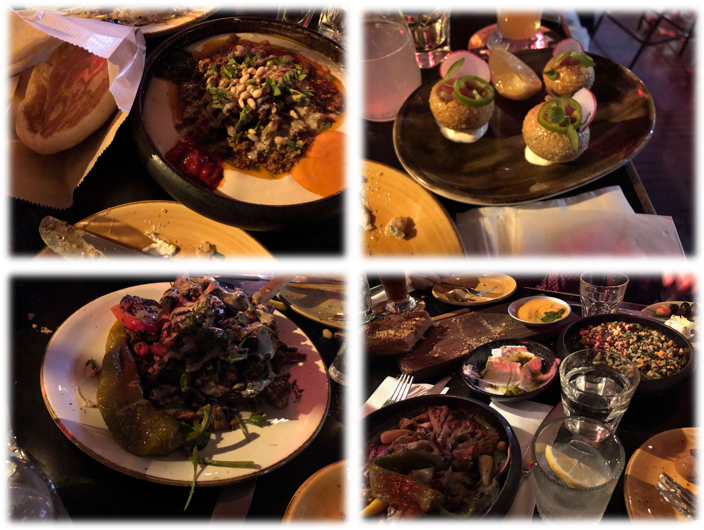

---
# Yesterday dinner (cont.)..


---
# High-throughput phenomics
.pull-left[
<div align="left">
<iframe src="https://innovate.unl.edu/video/leasing-options/greenhouse-innovation-center.mp4" width="250" height="150" frameBorder="0" class="giphy-embed" allowFullScreen></iframe><p><a href="https://innovate.unl.edu/greenhouse-innovation-center">UNL Greenhouse Innovation Center</a>
</p>
</div>

<div align="left">
<iframe width="260" height="200" src="https://www.youtube.com/embed/wor4BFjbIyI?rel=0" frameborder="0" allow="autoplay; encrypted-media" allowfullscreen></iframe>
<p><a href="https://www.youtube.com/watch?v=wor4BFjbIyI">Spidercam</a>
</div>

]

.pull-right[
<div align="right">
<p>Unmanned aerial vehicle<a href="https://www.frontiersin.org/articles/10.3389/fpls.2017.00421/full"> (Watanabe et al. 2017)</a>
</div>
]


---
# Pixelomics
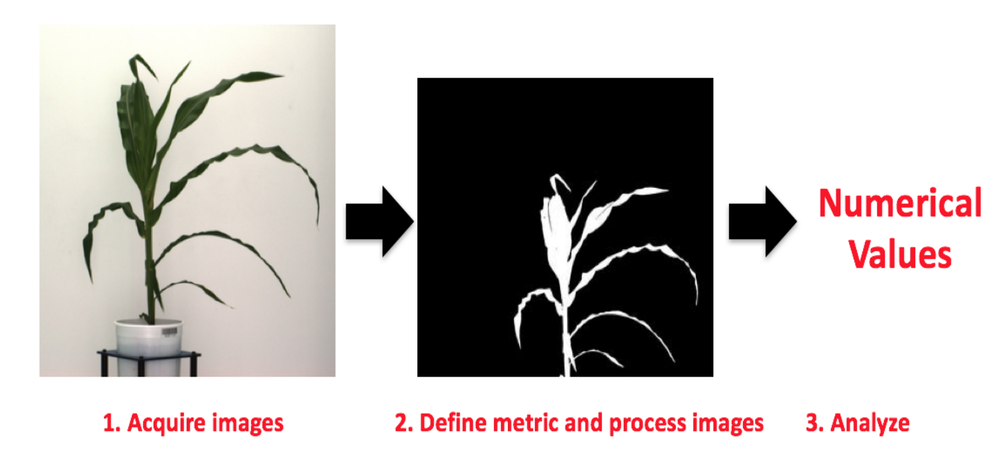
Converting image data into numerical values (e.g., 12.5, 45.8, 25.9, etc.)


---
# Automated image-based phenomics facility
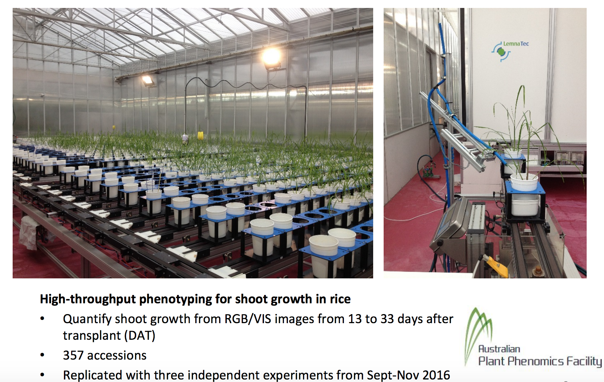


---
# Longitudinal data
Projected shoot area (PSA) = the sum of plant pixel from two side-view images and one top-view 
<div align="center">
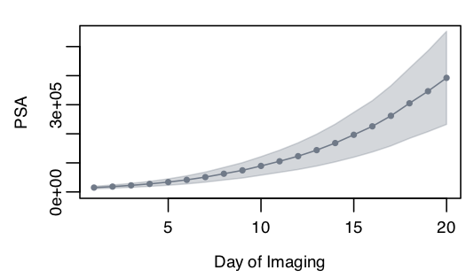<p><a href=""> Campbell et al. (2018)</a>
</div>
- Single time point analysis
   - cross-sectional analysis
- Longitudinal analysis 
   - leverage covariance among time points
   - account for longitudinal curve
   

---
class: inverse, center, middle

# Genomic BLUP


---
# Genomic best linear unbiased prediction
Suppose underlying signal is given by  
$$
\mathbf{y} = \mathbf{g} + \boldsymbol{\epsilon}
$$

where $\mathbf{g} \sim N(0, \mathbf{G}\sigma^2_g)$. 

We approximate the vector of genetic values $\mathbf{g}$ with a linear function  

$$
\mathbf{y} = \mathbf{W}\mathbf{a} + \boldsymbol{\epsilon}
$$

- $\mathbf{W}$ is the centered $n$ $\times$ $m$ matrix of additive marker genotypes 

- $\mathbf{a}$ is the vector of regression coefficients on marker genotypes 

- $\boldsymbol{\epsilon}$ is the residual 


---
# Genomic best linear unbiased prediction
Variance-covariance matrix of $\mathbf{y}$ is
\begin{align*}
\mathbf{V}_y &= \mathbf{V}_g + \mathbf{V}_{\epsilon} \\
&= \mathbf{WW'}\sigma^2_{a} + \mathbf{I} \sigma^2_{\epsilon}
\end{align*}

- $\mathbf{a} \sim N(0, \mathbf{I}\sigma^2_{\mathbf{a}})$  

- $\boldsymbol{\epsilon} \sim N(0, \mathbf{I}\sigma^2_{\boldsymbol{\epsilon}})$

- $\mathbf{V}_g = \mathbf{WW'}\sigma^2_{a}$ is the covariance matrix due to markers


---
# Genomic best linear unbiased prediction
If normality is assumed, the best linear unbiased prediction (BLUP) of $\mathbf{g}$ $(\hat{\mathbf{g}})$ is the conditional mean of $\mathbf{g}$ given the data  
\begin{align}
BLUP(\hat{\mathbf{g}}) &= E(\mathbf{g}|\mathbf{y}) = E[\mathbf{g}] + Cov(\mathbf{g}, \mathbf{y}^T) Var(\mathbf{y})^{-1}  [\mathbf{y} - E(\mathbf{y})] \notag \\
&=  Cov(\mathbf{W}\mathbf{a}, \mathbf{y}^T)\cdot \mathbf{V}_y^{-1}  \mathbf{y}  \notag \\
&= \mathbf{WW'}\sigma^2_{\mathbf{a}} [\mathbf{WW'}\sigma^2_{a} + \mathbf{I} \sigma^2_{\epsilon}]^{-1}  \mathbf{y}  \notag \\
&= [\mathbf{I} +    \frac{\sigma^2_{\epsilon}}{\mathbf{WW'}\sigma^2_{a}} ]^{-1}  \mathbf{y}  \\
&= [\mathbf{I} +  (\mathbf{WW'})^{-1}  \frac{\sigma^2_{\epsilon}}{\sigma^2_{a}} ]^{-1}  \mathbf{y}, 
\end{align}
assuming that $\mathbf{WW'}$ is invertible

- $Cov(\mathbf{W}) = \mathbf{WW'}$  is a covariance matrix of marker genotypes (provided that $X$ is centered), often considered to be the simplest form of additive genomic relationship kernel, $\mathbf{G}$. 


---
# Genomic best linear unbiased prediction
We can refine this kernel $Cov(\mathbf{W}) = \mathbf{WW'}$ by relating genetic variance $\sigma^2_g$ and marker genetic variance $\sigma^2_{a}$ under the following assumptions

Assume genetic value is parameterized as 
$g_{i} = \sum w_{ij} a_j$ 
where both $x$ and $a$ are treated as random and independent. 

Assuming linkage  equilibrium of markers (all loci are mutually independent) 
\begin{align*}
\sigma^2_g &= \sum_j 2 p_j(1-p_j) \cdot \sigma^2_{a_j}. \notag \\
\end{align*}
Under the homogeneous marker variance assumption
\begin{align}
\sigma^2_{a} &= \frac{\sigma^2_g}{2 \sum_j p_j(1-p_j) }.
\end{align}


---
# Genomic best linear unbiased prediction
Recall that 
\begin{align}
BLUP(\hat{\mathbf{g}}) &= [\mathbf{I} +  (\mathbf{WW'})^{-1}  \frac{\sigma^2_{\epsilon}}{\sigma^2_{a}} ]^{-1}  \mathbf{y}, 
\end{align}

Replacing $\sigma^2_{\beta}$ we get 
\begin{align}
BLUP(\hat{\mathbf{g}}) &= \left [\mathbf{I} +    (\mathbf{WW'})^{-1} \frac{\sigma^2_{\epsilon}}{ \frac{ \sigma^2_{g}}{2 \sum_j p_j(1-p_j)}} \right ]^{-1}  \mathbf{y}  \notag \\ 
&= \left [\mathbf{I} +    \mathbf{G}^{-1} \frac{\sigma^2_{\epsilon}}{ \sigma^2_g} \right ]^{-1}  \mathbf{y}  
\end{align}
where $\mathbf{G} = \frac{\mathbf{WW'}}{2 \sum_j p_j(1-p_j)}$ is known as the first $\mathbf{G}$ matrix  introduced in VanRaden (2008)


---
class: inverse, center, middle

# Ridge regression BLUP


---
## BLUP of marker effects 
Suppose that the phenotype-genotype mapping function is 
\begin{align*}
\mathbf{y} &= \mathbf{g} + \boldsymbol{\epsilon} \\
\mathbf{y} &= \mathbf{W}\mathbf{a} + \boldsymbol{\epsilon} \\
\mathbf{a} &\sim N(0, \mathbf{I}\sigma^2_{a})  
\end{align*}
The conditional expectation of $\mathbf{a}$ given $\mathbf{y}$ is 
\begin{align*}
BLUP(\mathbf{a}) &= E(\mathbf{a}| \mathbf{y})= Cov(\mathbf{a}, \mathbf{y})Var(\mathbf{y})^{-1} [\mathbf{y} - E(\mathbf{y})] \\
&= Cov(\mathbf{a}, \mathbf{W}\mathbf{a}) [\mathbf{W}\mathbf{W'} \sigma^2_{\mathbf{a}}+ \mathbf{I}\sigma^2_{\boldsymbol{\epsilon}}]^{-1} \mathbf{y} \\
&= \sigma^2_{\mathbf{a}} \mathbf{W}' [\mathbf{W}\mathbf{W'} \sigma^2_{\mathbf{a}} + \mathbf{I}\sigma^2_{\boldsymbol{\epsilon}}]^{-1} \mathbf{y} \\
&= \sigma^2_{\mathbf{a}} \mathbf{W'}  (\mathbf{W}\mathbf{W'})^{-1} [ \sigma^2_{\mathbf{a}}\mathbf{I} + (\mathbf{W}\mathbf{W'})^{-1} \sigma^2_{\boldsymbol{\epsilon}}]^{-1}  \mathbf{y} \\
&=  \mathbf{W}^T  (\mathbf{W}\mathbf{W'})^{-1} [ \mathbf{I} + (\mathbf{W}\mathbf{W'})^{-1}  \frac{\sigma^2_{\boldsymbol{\epsilon}}}{\sigma^2_{\mathbf{a}}} ]^{-1}  \mathbf{y}.
\end{align*}

Alternatively,
\begin{align*}
BLUP(\mathbf{a}) &=  \mathbf{W}^T [ (\mathbf{W}\mathbf{W'}) +  \frac{\sigma^2_{\boldsymbol{\epsilon}}}{\sigma^2_{\mathbf{a}}}\mathbf{I} ]^{-1}  \mathbf{y}. 
\end{align*}


---
# BLUP of marker effects 
Thus, 
\begin{align*}
BLUP(\mathbf{a}) &= \mathbf{W}^T  (\mathbf{W}\mathbf{W'})^{-1} [ \mathbf{I} + (\mathbf{W}\mathbf{W'})^{-1}  \frac{\sigma^2_{\boldsymbol{\epsilon}}}{\sigma^2_{\mathbf{a}}} ]^{-1}  \mathbf{y} \\
&=  \mathbf{W'}  (\mathbf{W}\mathbf{W'})^{-1} BLUP(\mathbf{g}).
\end{align*}
Thus, once we obtain $\hat{\mathbf{g}}$ from GBLUP, BLUP of marker coefficients is given by 
$\hat{\mathbf{a}} = \mathbf{W'} (\mathbf{W}\mathbf{W'})^{-1} \hat{\mathbf{g}}$

We arrive at the  same prediction regardless of whether we start from the genotype matrix $\mathbf{W}$ or from $\mathbf{g}$ 


---
# Random regression model (RRM, longitudinal GBLUP)
Predict random regression coefficients for each line using GBLUP
\begin{align*}
  \text{PSA}_{tjk} =\mu + \sum_{k=0}^{K_1}\phi(t)_{jk}\beta_k + \sum_{k=0}^{K_2}\phi(t)_{jk} u_{jk} + \sum_{k=0}^{K_3}\phi(t)_{jk} pe_{jk} + \epsilon_{tjk}
\end{align*}

- $\beta_k$: fixed mean trajectory 
- $\phi$: Legendre polynomial
- $u$: random additive genetic effect 
- $pe$: random permanent environmental effect
- $K$: order of fit
- $\epsilon$ residual

At time $t$, the GBLUP for the $j$th individual is

\begin{align*}
  \text{GBLUP}_{jt} = \phi_t\hat{u}_j
\end{align*}
  where $\phi_t$ is the row vector of the matrix of Legendre polynomials.


---
# Legendre polynomials 
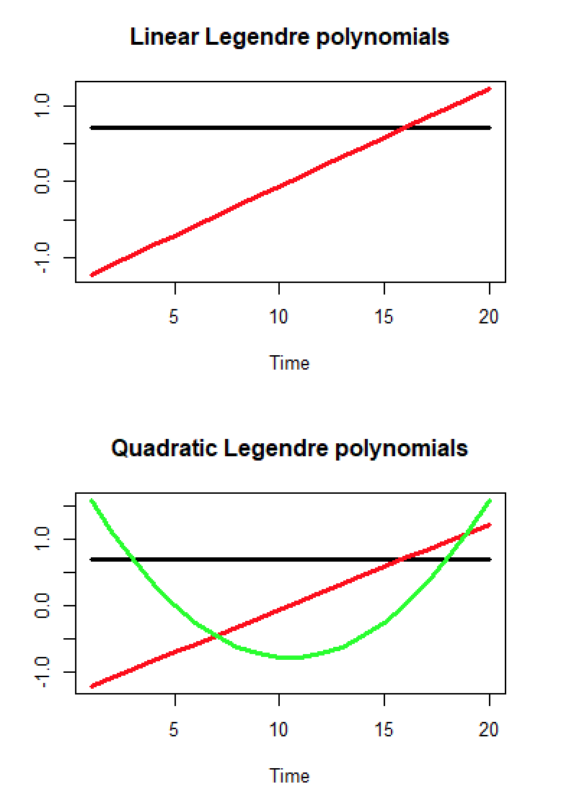


---
# The Phi matrix
Suppose there are 20 time points (t $\in$ 1, 2, $\cdots$, 20)

$$
\boldsymbol{\Phi} = \mathbf{M} \boldsymbol{\Lambda}
$$
- $\mathbf{M}$ is the $t_{max}$ by $d + 1$ matrix containing the polynomials of the standardized time covariate $\mathbf{M}_{k+1} = \left ( \frac{2(t - t_{min} )}{t_{max} - t_{min}} \right )^k- 1$ 

- $\boldsymbol{\Lambda}$ is the $d + 1 \times d + 1$  matrix of Legendre polynomial coefficients

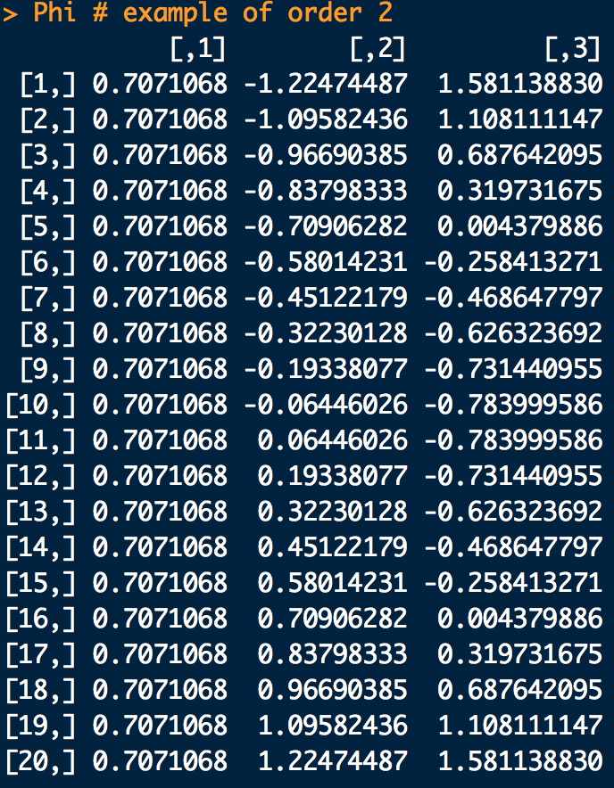


---
# Matrix notation of RRM
$$
\mathbf{y} = \mathbf{Xb} + \mathbf{Z}_1 \mathbf{u} + \mathbf{Z}_2 \mathbf{pe} + \boldsymbol{\epsilon}
$$

- $\mathbf{y}$: a column vector of $n'$ by 1, where $n'$ is the number of records

- $\mathbf{X}$: a matrix of $n'$ by $K_1$

- $\mathbf{Z_1}$: a matrix of $n'$ by $n * K_2$

- $\mathbf{Z_2}$: a matrix of $n'$ by $n * K_3$

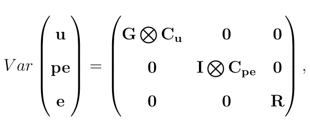


---
# Longitudinal genomic prediction
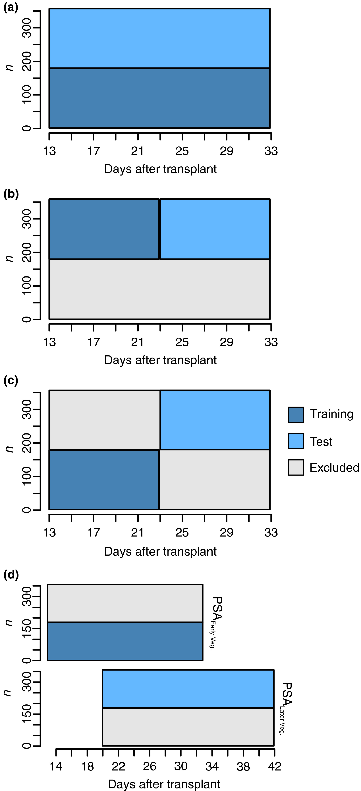
---
# Longitudinal genomic prediction
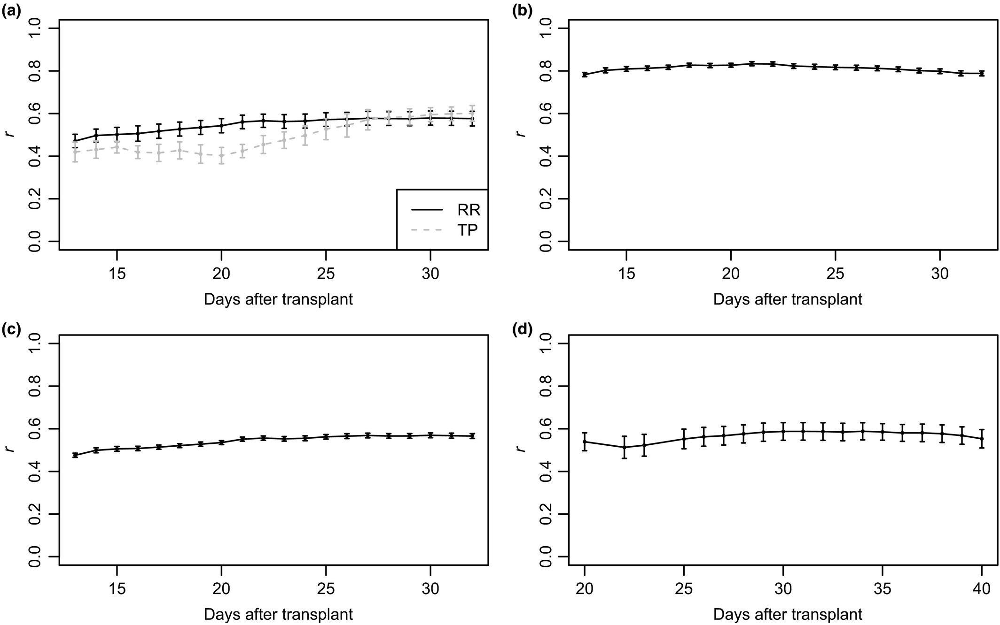


---
# Longitudinal genomic prediction
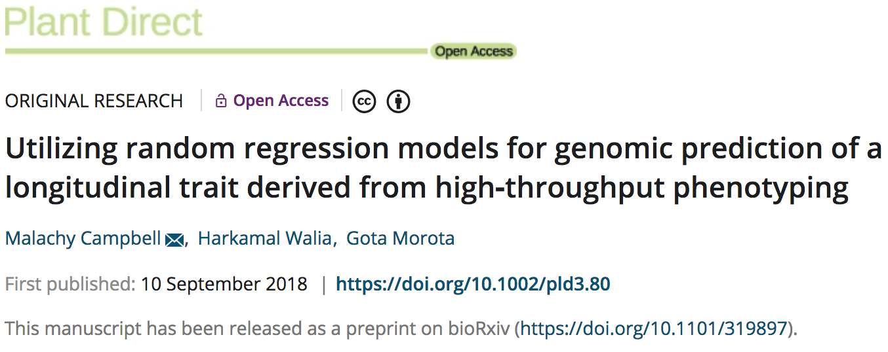


---
# Back-solving for SNP effects for shoot growth trajectories
- Predict genetic values with random regression model
- Solve for SNP effects

\begin{align*}
  BLUP(\boldsymbol{\beta}) &= \mathbf{W'}(\mathbf{WW'})^{-1}BLUP(\mathbf{g}).
\end{align*}
Then standardization of SNP effect is given by (Duarte et al. 2014) 

\begin{align*}
    \text{SNP}_{jt} &= \frac{ \mathbf{\hat{\beta}} }{ \sqrt{\text{Var}(\mathbf{\hat{\beta})}} } \\
    p\text{-value}_{SNP_{jt}} &= 2(1 - \phi (|\text{SNP}_{jt}|)). 
\end{align*}

where

\begin{align*}
  \text{Var}(\boldsymbol{\hat{\beta}}) = \mathbf{W'G^{-1}W}\sigma^2_g - \mathbf{W'G^{-1}C^{aa}G^{-1}W }.
\end{align*}
  

---
# Manhattan plots (700K SNPs)
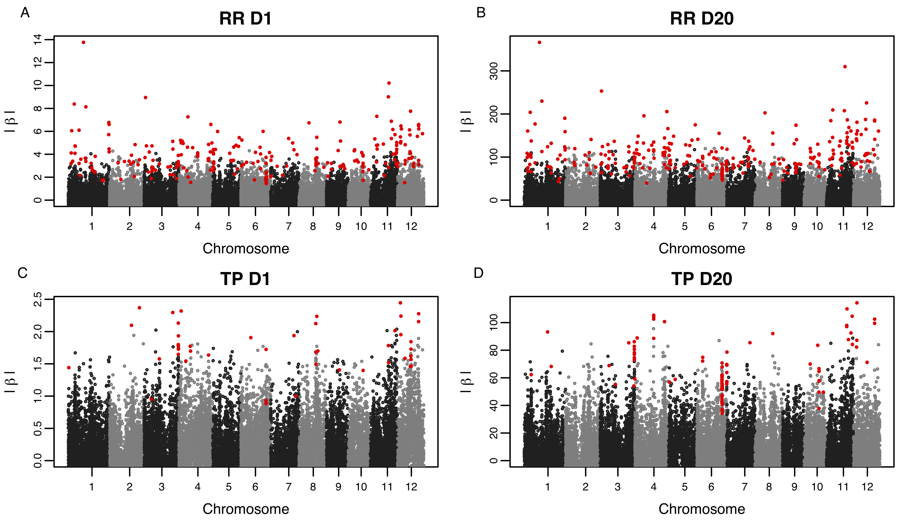

Top: random regression model. Bottom: single time point model

---
# Persistent and time specific QTL signals
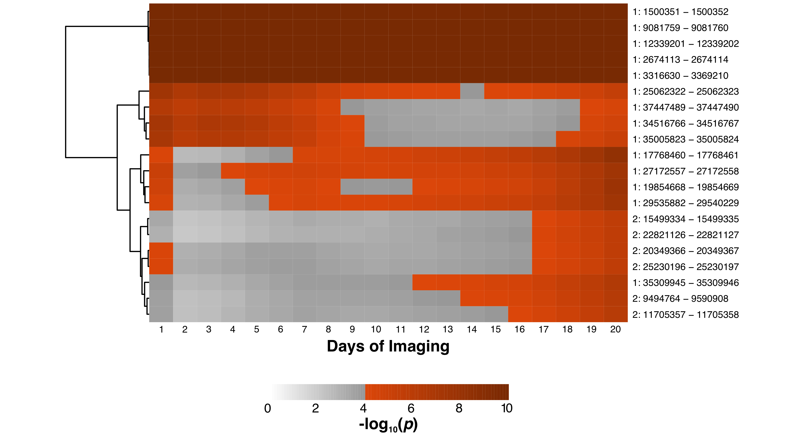

---
# Longitudinal GWAS
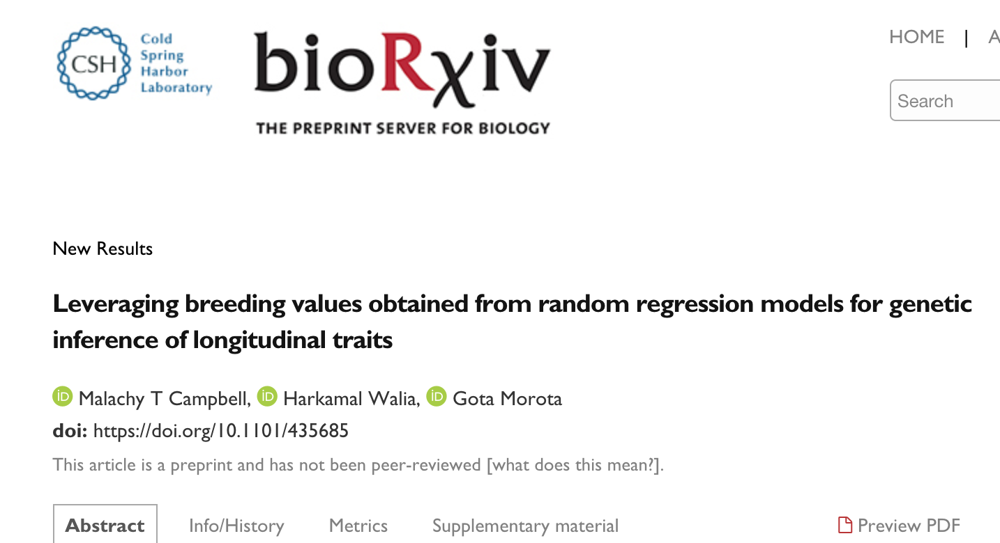


---
# Summary

- Random regression models provide a flexible framework for longitudinal genomic prediction and longitudinal GWAS

- Greater prediction accuracy with random regression

- Identifies time-specific genetic signals


